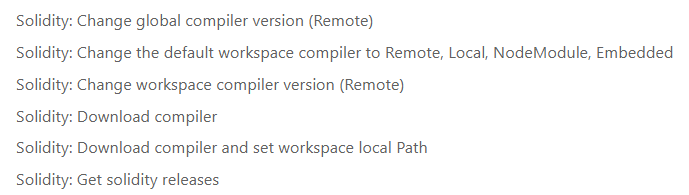

# Blockchain Development Notes

* [Changing version of Solidity](https://github.com/sakibcy/blockchain-dev-notes#changing-version-of-solidity) 
* [Usefull Package Manager](https://github.com/sakibcy/blockchain-dev-notes#usefull-package-manager)
* [Ethereum Concepts](https://github.com/sakibcy/blockchain-dev-notes#ethereum-concepts)

## Changing version of Solidity

#### Change version here first
```solidity
pragma solidity ^0.8.0; 
```

#### Change the compiler version in VS code


#### Change the version on ```truffle-config.js```
```javascript
compilers: {
    solc: {
      version: "0.8.0", // here
      optimizer: {
        enabled: true,
        runs: 200,
      },
```

## Usefull Package Manager
* <a href="https://www.npmjs.com/package/@openzeppelin/contracts" target="_blank">OpenZeppelin Contracts</a>
    * A library for secure smart contract development. Build on a solid foundation of community-vetted code.

## Ethereum Concepts
* <a href="https://academy.binance.com/en/glossary/gwei" target="_blank">Gwei</a>
